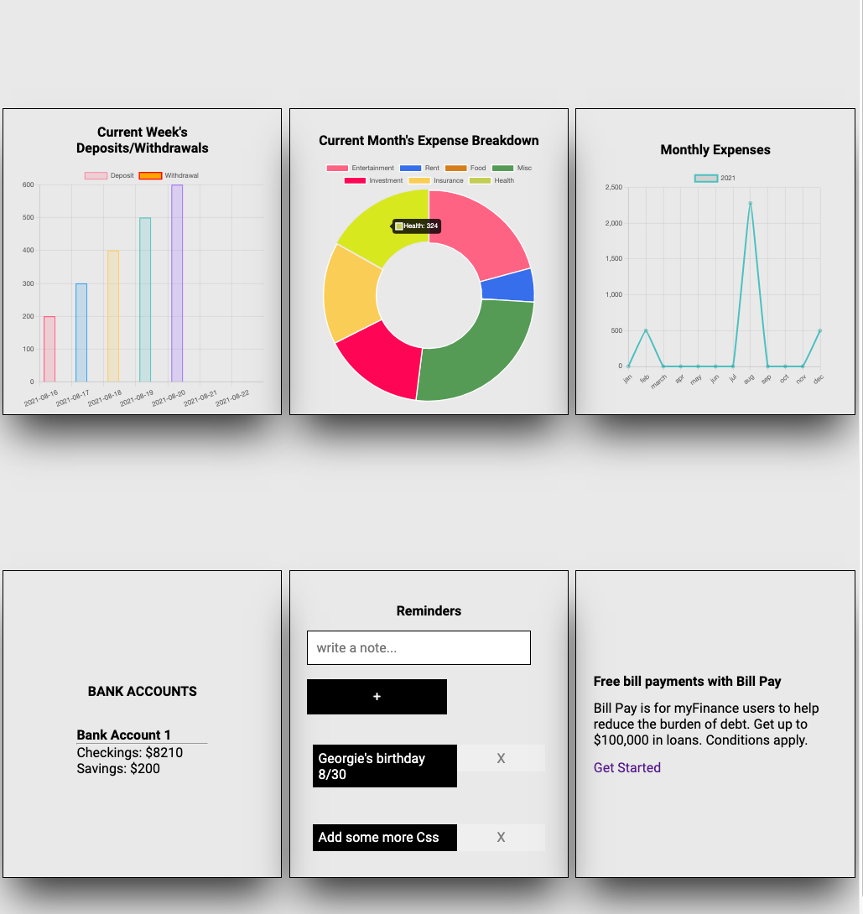

# myFinance

Hosting URL: https://myfinance-e9800.firebaseapp.com/

Walk Through:

1. Personal Finance app where users can keep track of their expenses, categorize these expenses into buckets, view monthly expenses, and view their weekly withdrawal/deposits. 

2. Users can go to the expenses tab in the side navigation to add expenses

3. Users can go to the banking tab to add/withdraw balances. And also allot their deposits to their savings account. 